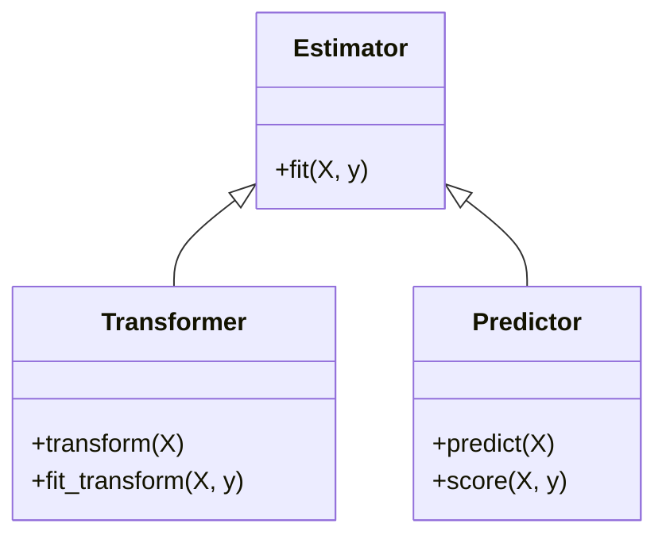

# 🛠️ Lecture 23.06: Introduction to Scikit-Learn (sklearn API Design)

[](https://www.python.org/)
[](https://scikit-learn.org/)
[](#)

🌐 **Language:** **English** | [हिंदी / Hinglish](README_HINGLISH.md) | [⬅️ Back to Lecture 23](../README.md)

---

## 📌 1. What is Scikit-Learn?

**Scikit-Learn (`sklearn`)** is the industry-standard open-source machine learning library for Python. Built on top of NumPy, SciPy, and Matplotlib, it provides robust, efficient, and mathematically sound implementations of virtually all classical machine learning algorithms.

### Core Design Philosophy:
The enduring success of `sklearn` stems from its **uniform, consistent object-oriented interface** (Buitinck et al., 2013). Regardless of whether you train a simple Linear Regression model or an ensemble Gradient Boosted Tree, the method names and call signatures remain identical.

---

## 🏛️ 2. The Three Architectural Pillars of Scikit-Learn



### 1. Estimator:
Any object that learns parameters from data.
- **Primary Method:** `estimator.fit(X, y)`
- Learns internal parameters (stored with a trailing underscore, e.g. `model.coef_`, `model.intercept_`).

### 2. Transformer:
An estimator that modifies, cleans, or scales feature matrices.
- **Primary Methods:** `transformer.transform(X)` and `transformer.fit_transform(X)`
- *Examples:* `StandardScaler`, `OneHotEncoder`, `PCA`.

### 3. Predictor:
An estimator capable of producing predictions on new data.
- **Primary Methods:** `predictor.predict(X_new)` and `predictor.score(X_test, y_test)`
- *Examples:* `LinearRegression`, `LogisticRegression`, `RandomForestClassifier`.

---

## 📦 3. Key Scikit-Learn Modules Overview

| Sub-Module | Purpose & Core Classes |
| :--- | :--- |
| `sklearn.linear_model` | Generalized linear models (`LinearRegression`, `Ridge`, `Lasso`, `LogisticRegression`) |
| `sklearn.model_selection` | Validation utilities (`train_test_split`, `KFold`, `GridSearchCV`) |
| `sklearn.preprocessing` | Feature transformations (`StandardScaler`, `MinMaxScaler`, `OneHotEncoder`) |
| `sklearn.metrics` | Performance assessment (`mean_squared_error`, `r2_score`, `accuracy_score`) |
| `sklearn.pipeline` | Chaining transformers and estimators into a single atomic workflow (`Pipeline`) |

---

## 💻 4. Python Implementation: Basic Scikit-Learn Workflow

```python
import numpy as np
from sklearn.linear_model import LinearRegression
from sklearn.metrics import mean_squared_error, r2_score

# 1. Prepare 2D feature matrix X and 1D target vector y
X = np.array([[1.0], [2.0], [3.0], [4.0], [5.0]])
y = np.array([2.2, 3.9, 6.1, 7.9, 10.2])

# 2. Instantiate the Estimator/Predictor
model = LinearRegression()

# 3. Fit the model to learn parameters
model.fit(X, y)

# 4. Inspect learned parameters (with trailing underscore)
print(f"Learned Weight (coef_):      {model.coef_[0]:.4f}")
print(f"Learned Bias (intercept_):   {model.intercept_:.4f}")

# 5. Make predictions
y_pred = model.predict(X)
print(f"R-squared Score:             {r2_score(y, y_pred):.4f}")
print(f"Mean Squared Error (MSE):    {mean_squared_error(y, y_pred):.4f}")
```
