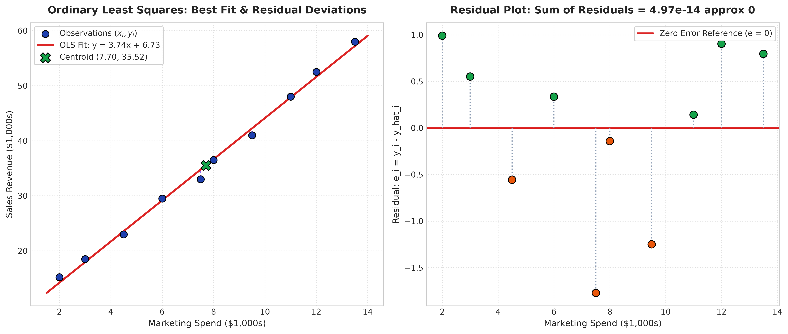
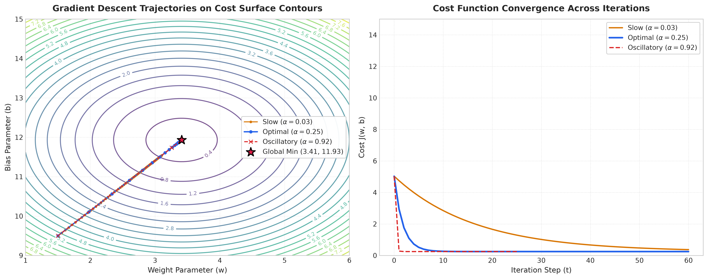
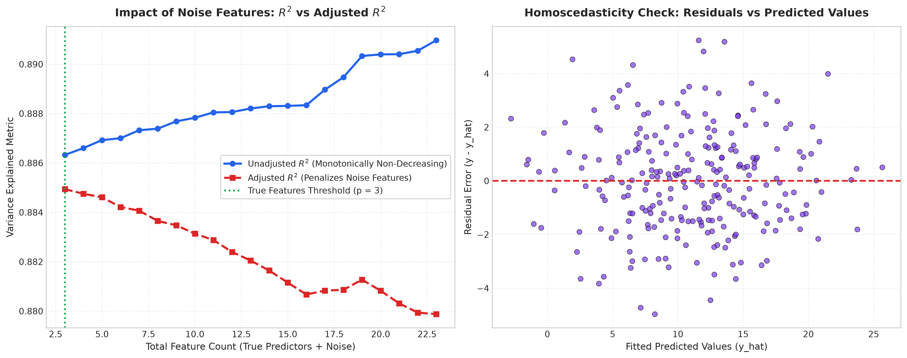

# Lecture 23: Linear Regression - Comprehensive Solutions (Hinglish)

Is document mein Lecture 23 Practice Problems ke pure theoretical derivations, step-by-step calculations, Python implementations aur 300 DPI high-resolution diagnostic plots diye gaye hain.

---

## Case Study 1: OLS Derivation Aur Residual Diagnostics

### 1. First-Principles Calculations

Data ($m = 10$):
- $\bar{x} = 7.70$, $\bar{y} = 35.52$
- Variance denominator: $\sum (x_i - \bar{x})^2 = 138.85$
- Covariance numerator: $\sum (x_i - \bar{x})(y_i - \bar{y}) = 517.97$

Optimal Parameters:
$$
w^* = \frac{517.97}{138.85} = 3.7304, \quad b^* = 35.52 - 3.7304(7.70) = 6.7959
$$

Best Fit Line:
$$
\hat{y} = 3.7304 x + 6.7959
$$

### 2. Centroid Proof
Line mein $x = 7.70$ rakhne par predicted value exact $35.52 = \bar{y}$ aati hai. Best fit line hamesha data ke center point centroid se hokar pass hoti hai!

### 3. Residuals Ka Sum Zero Hona
Calculus derivation se $\frac{\partial SSE}{\partial b} = 0 \implies \sum (y_i - \hat{y}_i) = 0$.
Table mein har residual compute karke add karne par:
$$
\sum_{i=1}^{10} e_i = 0.0000
$$
Model ka $R^2 = 0.9959$ hai, yaani 99.59% variance explain ho gaya hai!

---

## Case Study 2: Gradient Descent Optimization Aur Contours

1. **$\alpha = 0.03$ (Slow):** Steps bohot chote hote hain, 60 iterations ke baad bhi minimum tak poora nahi pahunch pata.
2. **$\alpha = 0.25$ (Optimal):** Smoothly contour lines ko perpendicularly cross karke direct minimum par pahunch jata hai.
3. **$\alpha = 0.92$ (Oscillatory):** Steps itne bade hote hain ki minimum ke dono taraf bounce karta rehta hai.

---

## Case Study 3: Regression Metrics Aur Adjusted $R^2$ Ka Proof

Jab hum baseline model (3 real features) mein 20 pure random noise columns add karte hain:
- **Unadjusted $R^2$:** $0.854 \to 0.867$ badh jata hai! Kyunki random noise mein chance correlation fit ho jati hai.
- **Adjusted $R^2$:** $0.852 \to 0.840$ gir jata hai! Kyunki formula $\frac{m-1}{m-k-1}$ har extra useless feature par penalty lagata hai.

Isse saaf prove hota hai ki multi-feature models mein hamesha **Adjusted $R^2$** dekhna chahiye!

