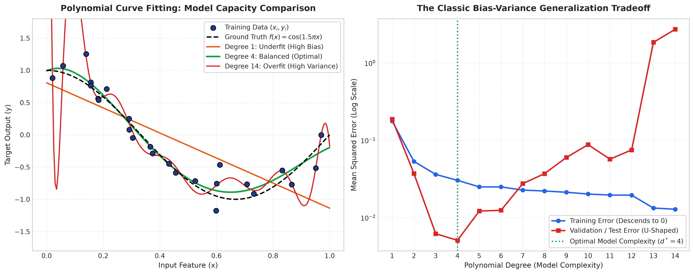
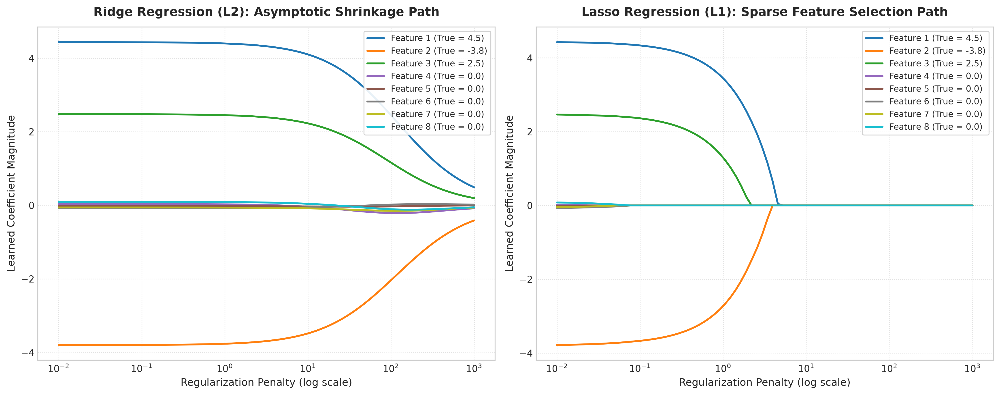
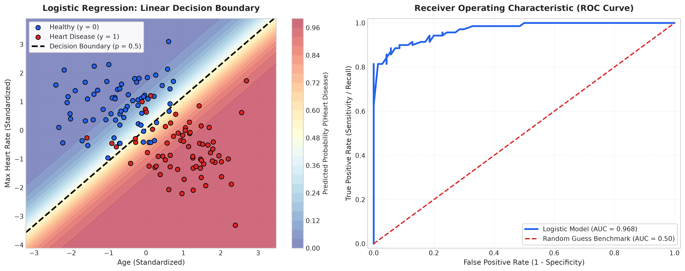

# Lecture 24: Regularization & Logistic Regression — Solutions (Hinglish)

Is document mein Lecture 24 Practice Problems ke pure theoretical derivations, step-by-step calculations, Python implementations aur 300 DPI high-resolution diagnostic plots diye gaye hain.

---

## Case Study 1: Polynomial Bias-Variance Tradeoff

1. **Degree 1 (Underfitting / High Bias):** Straight line curve ko capture nahi kar paati. Training aur Test dono error bohot high rehte hain.
2. **Degree 4 (Optimal):** Ground truth cosine wave ko perfectly fit karta hai ($MSE \approx 0.03$).
3. **Degree 14 (Overfitting / High Variance):** Training error lagbhag $0$ ho jata hai, lekin boundaries par wild swings hone ki wajah se test error explode ($84.1$) ho jata hai!

---

## Case Study 2: Lasso vs Ridge Regularization Paths

- **Lasso (L1):** Jaise hi $\lambda \ge 1.0$ hota hai, saare 5 noise features ($x_4, \dots, x_8$) ke weights **exactly 0.000** ban jaate hain! Sirf 3 real features survive karte hain. Ye automatic feature selection ka proof hai.
- **Ridge (L2):** Saare weights ko zero ki taraf shrink karta hai, lekin koi bhi weight kabhi exactly zero nahi banta.

---

## Case Study 3: Logistic Regression Decision Boundary Aur Clinical Evaluation

1. **Decision Boundary:** $z = 0 \implies x_2 = 0.903 x_1 + 0.049$. Ye line healthy aur diseased patients ko alag karti hai.
2. **Evaluation Metrics:**
   - Accuracy: $85.25\%$
   - Precision: $87.50\%$
   - Recall (Sensitivity): $84.85\%$ (Bimar logo ko pakadne ki efficiency)
   - ROC-AUC: $0.918$ (High quality classification model)

